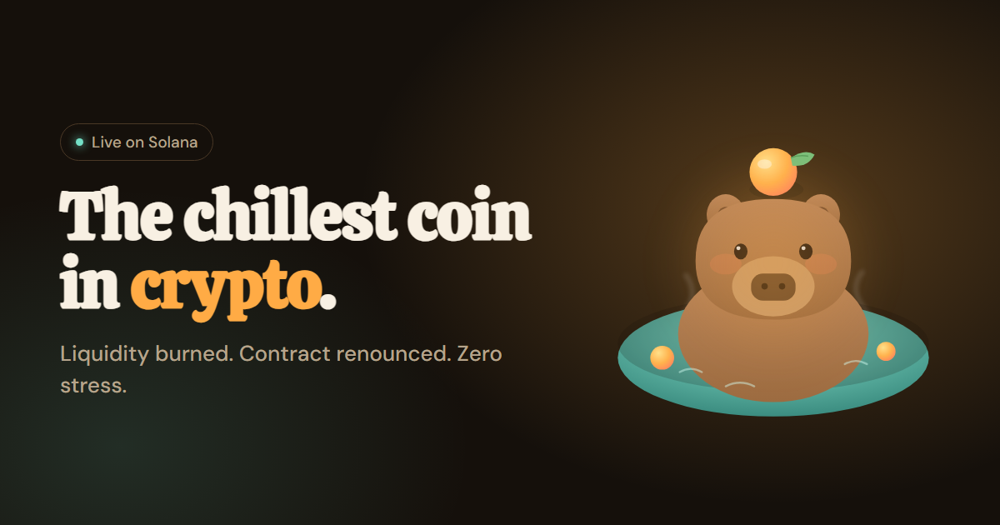

# $CAPY — лендинг мемкоина

Англоязычный лендинг мемкоина на Solana с самым спокойным персонажем в крипте — капибарой.
Задача такого сайта — за несколько секунд передать характер монеты и ответить на вопросы
осторожного покупателя: сожжена ли ликвидность, отказались ли от контракта, есть ли налог.

**Живое демо → https://automatorr192-dev.github.io/capy/**

## Что внутри

- Иллюстрированный первый экран и «правила дома» вместо сухого whitepaper.
- Живой график цены, копирование адреса контракта одним нажатием, блок FAQ.
- Дисклеймер о рисках в подвале.
- SEO: title, description, Open Graph, разметка JSON-LD (сайт и FAQ), sitemap и robots.

## Сейчас это демо

Монета вымышленная. Цена на графике генерируется случайно, адрес контракта и ссылки на
сообщества — заглушки.

## Стек

HTML · CSS · JavaScript без фреймворка · GitHub Pages · `Dockerfile` с nginx и `amvera.yml`
для переезда на Amvera
